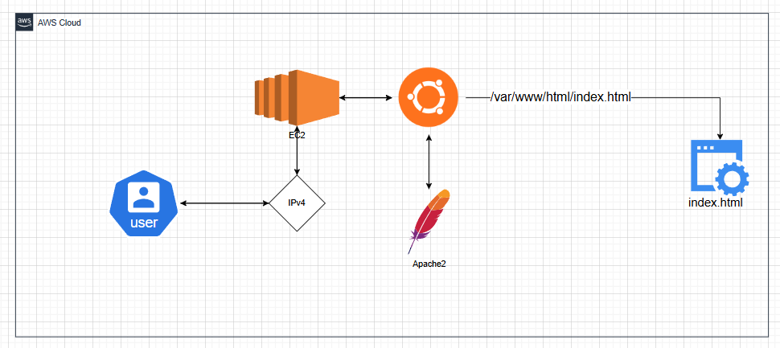
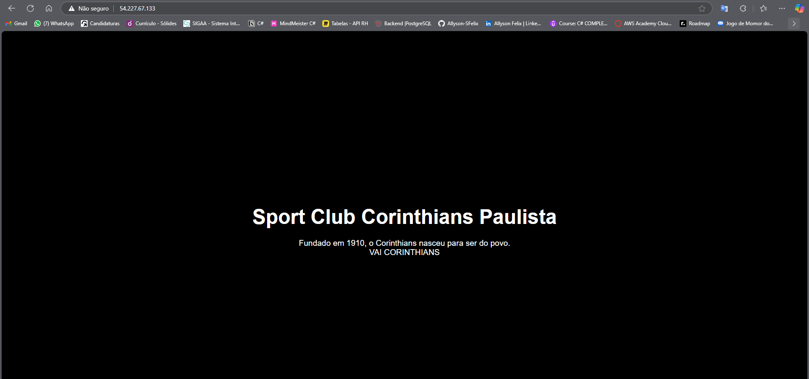

<h2> Projeto Hospedado na Instância EC2 </h2>
<h3>Visão Geral do Projeto</h3>

Esta pasta contém a configuração e os scripts para a implantação da nossa aplicação na instância EC2 da AWS. O objetivo é servir a interface do usuário (frontend) e conectá-la aos nossos serviços de backend.

<h3>🛠️ Arquitetura e Tecnologias</h3>

A aplicação é servida por um servidor web (Apache) rodando na instância EC2, como na imagem abaixo:

<h3>📁 Arquivos do Frontend</h3>

Na pasta front-end está o arquivo html utilizado.

<h3>Imagem da aplicação em deploy</h3>

